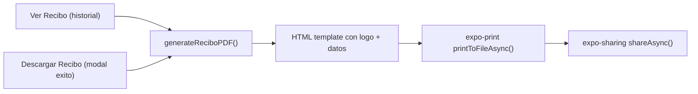

# Recibos PDF para Ventas

## Librerias

Instalar `expo-print` y `expo-sharing`:

- `expo-print` genera PDFs a partir de HTML (funciona en web, iOS y Android)
- `expo-sharing` permite compartir/descargar el archivo generado

```bash
npx expo install expo-print expo-sharing
```

## Flujo



## Archivos

### 1. Crear `lib/pdf/recibo-template.ts`

Funcion pura que recibe los datos y retorna un string HTML completo listo para imprimir como PDF:

```typescript
interface ReciboData {
  ventaId: string;
  fecha: Date;
  items: {
    nombre: string;
    cantidad: number;
    precioUnitario: number;
    totalLinea: number;
  }[];
  subtotal: number;
  descuento: number;
  total: number;
  metodoPago: string;
  negocioNombre?: string;
}

export function buildReciboHTML(data: ReciboData, logoBase64: string): string;
```

El template HTML tendra:

- Logo de la papeleria centrado arriba (imagen base64 embebida del `assets/images/pape.png`)
- Nombre del negocio debajo del logo
- Separador
- Datos de la venta: fecha formateada, ID de venta (ultimos 6 chars)
- Tabla de productos: nombre, cantidad, precio unitario, total linea
- Subtotal, descuento (si aplica), **Total** destacado
- Metodo de pago
- Pie de pagina con "Gracias por su compra"
- Estilos inline limpios, fuente sans-serif, ancho fijo tipo ticket (~300px centrado)

### 2. Crear `lib/pdf/generate-recibo.ts`

Funcion que orquesta la generacion y sharing:

```typescript
export async function generateAndShareRecibo(data: ReciboData): Promise<void>;
```

- Convierte el logo PNG a base64 usando `expo-file-system` o lo embebe como constante (mas simple para web)
- Llama `buildReciboHTML(data, logoBase64)`
- En web: usa `expo-print.printAsync({ html })` que abre el dialog de impresion del navegador (permite guardar como PDF)
- En nativo: usa `printToFileAsync({ html })` + `shareAsync(uri)` para compartir el archivo

### 3. Modificar [app/(tabs)/history/index.tsx](<app/(tabs)/history/index.tsx>)

Cambiar `handleVerRecibo` (linea 394, actualmente `console.log`) para:

- Obtener los datos de la venta y sus detalles del `detallesMap`
- Mapear `producto_id` a nombre usando `productNames`
- Llamar `generateAndShareRecibo(...)`

### 4. Modificar [components/ventas/VentaExitosaModal.tsx](components/ventas/VentaExitosaModal.tsx) o donde se conecta `onDescargarRecibo`

Conectar el boton "Descargar Recibo" del modal de exito con la misma funcion `generateAndShareRecibo`. Esto requiere que al completar la venta se guarden tambien los items vendidos (o se pasen al modal). Se puede hacer via `checkout-store` extendiendo `VentaCompletada` con los items.

### 5. Logo base64

Convertir `assets/images/pape.png` a una constante base64 en `lib/pdf/logo.ts` para evitar dependencias de file system en web. Es una imagen pequena (~34 lineas), el base64 sera razonable.

## Archivos afectados

- **Instalar**: `expo-print`, `expo-sharing`
- **Crear**: `lib/pdf/recibo-template.ts`, `lib/pdf/generate-recibo.ts`, `lib/pdf/logo.ts`
- **Modificar**: `app/(tabs)/history/index.tsx` (handleVerRecibo)
- **Modificar**: `store/checkout-store.ts` (extender VentaCompletada con items para el modal)
- **Modificar**: `components/ventas/CartPanel.tsx` (pasar items al setSuccessVenta)
- **Modificar**: Donde se conecta onDescargarRecibo del VentaExitosaModal
