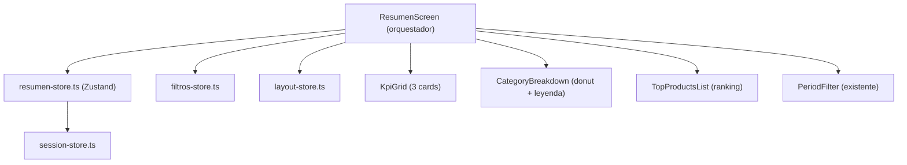

# Refactorizar Pantalla de Resumen

## Problema actual

La pantalla `[app/(tabs)/resumen/index.tsx](<app/(tabs)`/resumen/index.tsx>) tiene **795 lineas** con todo inline:

- 4 KPI cards (el usuario quiere quitar Transacciones)
- Grafico LineChart de Evolucion (el usuario quiere eliminarlo)
- Grafico PieChart de Categorias
- Listas de productos mas/menos vendidos
- Toda la logica de metricas, filtrado y listener en el mismo archivo
- El componente `[components/resumen/kpisCard.tsx](components/resumen/kpisCard.tsx)` tiene un diseno basico con colores solidos fuertes

## Arquitectura propuesta



## Cambios

### 1. Crear `store/resumen-store.ts` (Zustand)

Centraliza datos y metricas derivadas. El store:

- Suscribe al listener real-time `onVentasByNegocio` via accion `subscribe(negocioId)`
- Cachea detalles de ventas igual que hoy
- Expone **selectores derivados** para metricas (ventasTotales, gananciaNeta, devoluciones), productos top, y datos de categorias
- Lee `periodo` y `rangoPersonalizado` de `filtros-store` para filtrar
- Elimina toda logica de `datosEvolucion` (no se necesita)

Interfaz aproximada:

```typescript
interface ResumenStore {
  ventas: Venta[];
  detalles: VentaDetalle[];
  loading: boolean;
  error: string | null;
  subscribe: (negocioId: string) => () => void;
}
```

Los selectores se exportan como funciones puras que reciben el estado:

```typescript
export function selectMetricas(ventas, detalles, products, periodo, rango) { ... }
export function selectProductosTop(ventas, detalles, products) { ... }
export function selectCategorias(ventas, detalles, products, categories) { ... }
```

### 2. Redisenar componentes en `components/resumen/`

**a) `components/resumen/KpiGrid.tsx`** - Reemplaza `kpisCard.tsx`

- 3 KPIs: **Ventas Totales**, **Ganancia Neta**, **Devoluciones** (se elimina Transacciones)
- Diseno limpio: fondo blanco/dark con acento de color sutil (borde izquierdo o icono), no cards de color solido completo
- Desktop: 3 columnas en fila. Mobile: apiladas o 2+1
- Muestra subtexto con numero de transacciones y porcentaje de ganancia
- Formato moneda con `$XX.XX`

**b) `components/resumen/CategoryBreakdown.tsx`** - Extrae PieChart

- Contiene el PieChart SVG actual (donut) + leyenda
- Card contenedora con titulo y estado vacio
- Responsive: en mobile el chart es mas pequeno

**c) `components/resumen/TopProductsList.tsx`** - Extrae ranking de productos

- Componente unificado para "mas vendidos" y "menos vendidos"
- Recibe `items`, `title`, `variant` ("top" | "bottom") como props
- Diseno mas compacto: badge numerico + nombre + cantidad + total en una fila limpia
- Desktop: dos columnas lado a lado. Mobile: apiladas

### 3. Eliminar codigo muerto

- Eliminar `LineChart` completo (inline en index.tsx)
- Eliminar `datosEvolucion` useMemo
- Eliminar import de `Dimensions`
- Eliminar `kpisCard.tsx` viejo (reemplazado por `KpiGrid.tsx`)

### 4. Simplificar `app/(tabs)/resumen/index.tsx`

La pantalla queda como un orquestador delgado (~80-100 lineas):

- Lee de `resumen-store` (ventas, loading, error)
- Lee de `filtros-store` (periodo)
- Lee de `layout-store` (isMobile)
- Efecto para suscribir al store cuando `sessionReady` y `negocioId` disponibles
- Renderiza: `PeriodFilter` + `KpiGrid` + grid de `CategoryBreakdown` y `TopProductsList`

### 5. Responsive layout

- Mobile: todo apilado verticalmente, padding reducido
- Desktop: KPIs en fila de 3, luego CategoryBreakdown y TopProducts en grid de 2 columnas
- Se usa `useLayoutStore().isMobile` en vez de `Dimensions.get()` para consistencia

## Archivos afectados

- **Crear**: `store/resumen-store.ts`, `components/resumen/KpiGrid.tsx`, `components/resumen/CategoryBreakdown.tsx`, `components/resumen/TopProductsList.tsx`
- **Reescribir**: `app/(tabs)/resumen/index.tsx`
- **Eliminar**: `components/resumen/kpisCard.tsx`
