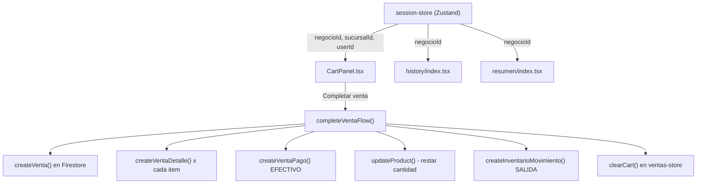

# Flujo Completo de Ventas con Firestore

## Estado actual

- `handleCompleteVenta` en `CartPanel.tsx` (linea 75) solo limpia el carrito localmente, no persiste nada en Firestore
- `history/index.tsx` y `resumen/index.tsx` caen a datos mock (`generateMockData()`) cuando no hay ventas o hay error
- `getVentasByNegocio` en `lib/services/ventas/index.ts` usa `where()` + `orderBy()` que requiere un indice compuesto en Firestore (causa el error reportado)
- No existe una store de sesion; cada pantalla obtiene `negocioId` individualmente via `onAuthStateChanged` + `getNegocioIdByUsuario`
- No hay funcion que obtenga `sucursal_id` del usuario actual

## Arquitectura propuesta



## Cambios a realizar

### 1. Crear `store/session-store.ts` (Zustand)

Store centralizada que se inicializa una vez al autenticarse y provee: `userId`, `userEmail`, `negocioId`, `sucursalId`.

- Se inicializa en el layout principal (`_layout.tsx`) escuchando `onAuthStateChanged`
- Llama `getNegocioIdByUsuario()` y `getSucursalesByNegocio()` para obtener la primera sucursal activa
- Todas las pantallas consumen de aqui en vez de hacer fetch individual

### 2. Crear `lib/services/ventas/complete-venta.ts`

Funcion `completeVentaFlow` que orquesta toda la venta:

```typescript
interface CompleteVentaParams {
  items: CartItem[];
  negocioId: string;
  sucursalId: string;
  userId: string;
  total: number;
  subtotal: number;
}
```

Pasos internos:

1. `createVenta()` con estado `PAGADA`, tipo `CONTADO`
2. `createVentaDetalle()` por cada item del carrito
3. `createVentaPago()` con metodo `EFECTIVO` y monto = total
4. Para cada item: `updateProduct(productId, { cantidad: product.cantidad - item.quantity })`
5. Para cada item: `createInventarioMovimiento()` tipo `SALIDA`, motivo `Venta #{ventaId}`

Si falla cualquier paso, loguear el error (no hay transacciones atomicas en Firestore client-side, pero se registra el error).

### 3. Modificar `CartPanel.tsx` - `handleCompleteVenta`

- Importar `useSessionStore` para obtener `negocioId`, `sucursalId`, `userId`
- Llamar `completeVentaFlow()` con los datos del carrito
- Manejar loading state durante la operacion
- Al exito: limpiar carrito + mostrar modal de exito con datos reales (id de Firestore, fecha, total)
- Al error: notificar al usuario sin limpiar el carrito

### 4. Corregir `getVentasByNegocio` en [lib/services/ventas/index.ts](lib/services/ventas/index.ts)

Cambiar de `where() + orderBy()` (requiere indice) a:

- Solo `where('negocio_id', '==', negocio_id)`
- Ordenar en memoria con `.sort()` (igual que ya hace `getProductsByNegocio`)

Esto elimina el error `FirebaseError: The query requires an index`.

Aplicar el mismo patron a `getVentasBySucursal` y `getVentasByEstado` que tambien usan `orderBy`.

### 5. Limpiar `history/index.tsx`

- Eliminar `generateMockData()` completamente (lineas 51-189)
- Eliminar todo el fallback a mock data en `loadData()` y en el catch
- Usar `useSessionStore` para obtener `negocioId` en vez de `onAuthStateChanged` + `getNegocioIdByUsuario`
- Si no hay ventas, mostrar estado vacio real ("No hay ventas registradas")
- Si hay error, mostrar mensaje de error real

### 6. Limpiar `resumen/index.tsx`

- Eliminar `generateMockData()` y los fallbacks a datos mock
- Usar `useSessionStore` para obtener `negocioId`
- Cargar ventas reales desde Firestore
- Mostrar estado vacio si no hay datos

### 7. Actualizar stock local en `productos-store`

Despues de completar la venta, actualizar `products` en `useProductosStore` para reflejar el stock reducido sin necesidad de refetch:

```typescript
const updatedProducts = products.map((p) => {
  const cartItem = items.find((i) => i.productId === p.id);
  return cartItem ? { ...p, cantidad: p.cantidad - cartItem.quantity } : p;
});
useProductosStore.getState().setProducts(updatedProducts);
```

### 8. Limpieza general del backend

- Revisar que todos los servicios en `lib/services/` tengan manejo de errores consistente
- Asegurar que los helpers de conversion `toDate()` sean uniformes
- Verificar imports limpios sin dependencias circulares

## Archivos a modificar

- **Nuevo:** `store/session-store.ts`
- **Nuevo:** `lib/services/ventas/complete-venta.ts`
- **Modificar:** [components/ventas/CartPanel.tsx](components/ventas/CartPanel.tsx) - usar servicio real
- **Modificar:** [lib/services/ventas/index.ts](lib/services/ventas/index.ts) - ordenar en memoria
- **Modificar:** [app/(tabs)/history/index.tsx](<app/(tabs)/history/index.tsx>) - eliminar mock data
- **Modificar:** [app/(tabs)/resumen/index.tsx](<app/(tabs)/resumen/index.tsx>) - eliminar mock data
- **Modificar:** [app/layout.tsx](app/_layout.tsx) - inicializar session store
- **Modificar:** [store/checkout-store.ts](store/checkout-store.ts) - agregar loading state
