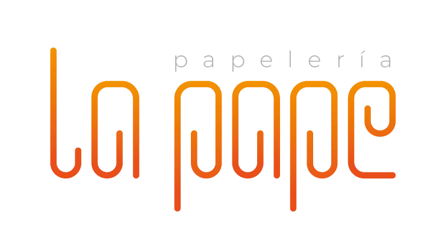

<div align="center">
  

  <h1>La Pape — Sistema de Ventas</h1>
  <p>Punto de venta multi-tenant para negocios chilenos</p>

  <p>
    
    
    
    
  </p>
</div>

---

## ¿Qué es La Pape?

**La Pape** es una aplicación móvil/web de punto de venta (POS) diseñada para pequeños y medianos negocios chilenos. Soporta múltiples usuarios, sucursales y entidades de negocio (negocios) desde una sola plataforma. Funciona en **Android**, **iOS** y **Web**.

---

## Stack tecnológico

| Capa        | Tecnología                                                       |
| ----------- | ---------------------------------------------------------------- |
| Routing     | Expo Router v6 — rutas basadas en archivos, tipadas              |
| Estilos     | NativeWind v5 (Tailwind vía `className`) — dark mode con `dark:` |
| Estado      | Zustand v5 — un store por dominio                                |
| Backend     | Firebase Firestore (listeners en tiempo real) + Firebase Auth    |
| Formularios | React Hook Form + Zod                                            |
| Animaciones | React Native Reanimated (`useSharedValue` / `withTiming`)        |
| Imágenes    | `expo-image` (mejor caché que el `Image` nativo)                 |
| Íconos      | SF Symbols en iOS, MaterialIcons en Android/Web                  |

---

## Estructura de rutas

```
app/
├── (auth)/index.tsx        ← Pantalla de login
├── index.tsx               ← Splash / redirección inicial
├── configuracion.tsx       ← Ajustes de la cuenta
└── (tabs)/
    ├── ventas/             ← POS / carrito de compra
    ├── productos/          ← Inventario (lista → detalle → editar/crear)
    ├── history/            ← Historial de ventas
    └── resumen/            ← Dashboard de analíticas
```

---

## Arquitectura de estado (Zustand)

| Store               | Propósito                                                 |
| ------------------- | --------------------------------------------------------- |
| `useSessionStore`   | Sesión: `userId`, `negocioId`, `sucursalId`, flag `ready` |
| `useResumenStore`   | Métricas de venta en tiempo real, `detallesMap`, rankings |
| `useFiltrosStore`   | Filtro de rango de fechas compartido entre pantallas      |
| `useProductosStore` | Catálogo de productos, categorías, `currentProduct`       |
| `useVentasStore`    | Ítems del carrito y totales                               |
| `useLayoutStore`    | Flag `isMobile` para breakpoints responsivos              |

> `useSessionStore.hydrate(user)` se ejecuta en `onAuthStateChanged` y carga `negocioId`/`sucursalId` desde Firestore. Espera `ready === true` antes de renderizar pantallas autenticadas.

---

## Modelo de datos Firebase

```
usuarios            → datos del usuario autenticado
negocios            → entidades de negocio
sucursales          → branches/locales de cada negocio
usuarios-negocios   → relación many-to-many con roles
productos           → catálogo de productos
categorias          → categorías de productos
ventas              → cabeceras de venta
ventas-detalle      → líneas de detalle de cada venta
ventas-pagos        → métodos de pago por venta
clientes            → base de clientes
inventario-movimientos → trazabilidad de stock
```

Todos los servicios viven en `lib/services/<dominio>/`. Firebase se inicializa en `lib/firebase.ts`. Una app secundaria en `lib/firebase-secondary.ts` se usa para el flujo de creación de usuarios admin (para no cerrar la sesión actual).

---

## Módulo Resumen (Dashboard)

El dashboard sigue el patrón **orquestador + componentes especializados**. `app/(tabs)/resumen/index.tsx` solo coordina stores y baja datos — sin lógica de negocio inline.

```
components/resumen/
├── shared/SectionCard.tsx          ← wrapper de card (bg, border, shadow)
├── shared/EmptyState.tsx           ← estado vacío con ícono
├── KpiGrid.tsx                     ← 3 KPI cards con animación escalonada
├── CategoryBreakdown.tsx           ← donut chart + leyenda de barras
├── VentasPorUsuario.tsx            ← filas de vendedor con barra de participación
├── TopProductsList.tsx             ← top productos (RankingRow)
└── ProductosBajoStockList.tsx      ← bajo stock (StockRow)
```

---

## Comandos de desarrollo

```bash
npm install           # Instalar dependencias
expo start            # Servidor de desarrollo (iOS / Android / Web)
expo start --web      # Solo web
expo run:android      # Build y ejecutar en Android
expo run:ios          # Build y ejecutar en iOS (requiere macOS)
expo lint             # Ejecutar ESLint
```

---

## Convenciones clave

### Formateo de moneda y fechas

Siempre importar desde `@/lib/utils/format`:

```ts
import { formatCurrency, formatDate, pluralize } from "@/lib/utils/format";
// Moneda en locale chileno: $12.345,60
```

### Responsive

```ts
const { width } = useWindowDimensions();
const isDesktop = width >= 768;
// o desde el store:
const isMobile = useLayoutStore((s) => s.isMobile);
```

### Haptics (siempre con guard de plataforma)

```ts
if (Platform.OS !== "web") Haptics.impactAsync(Haptics.ImpactFeedbackStyle.Light);
```

### Animaciones

Usar siempre `useSharedValue` / `withTiming` de Reanimated. **Nunca** `Animated` del core de React Native.

---

## Estructura del repositorio

```
app/          → pantallas y rutas (Expo Router)
components/   → componentes UI reutilizables por feature
lib/          → integraciones Firebase, servicios, validaciones, PDF
store/        → stores Zustand
interface/    → tipos/interfaces de dominio compartidos
assets/       → imágenes e íconos estáticos
android/      → proyecto nativo Android
ios/          → proyecto nativo iOS
```

---

<div align="center">
  <sub>Construido con ❤️ en Chile · <strong>La Pape v1.0.0</strong></sub>
</div>
